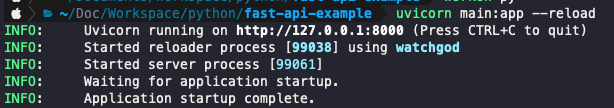
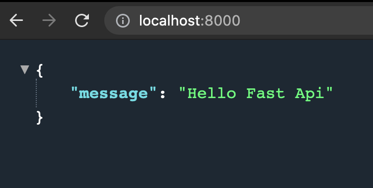
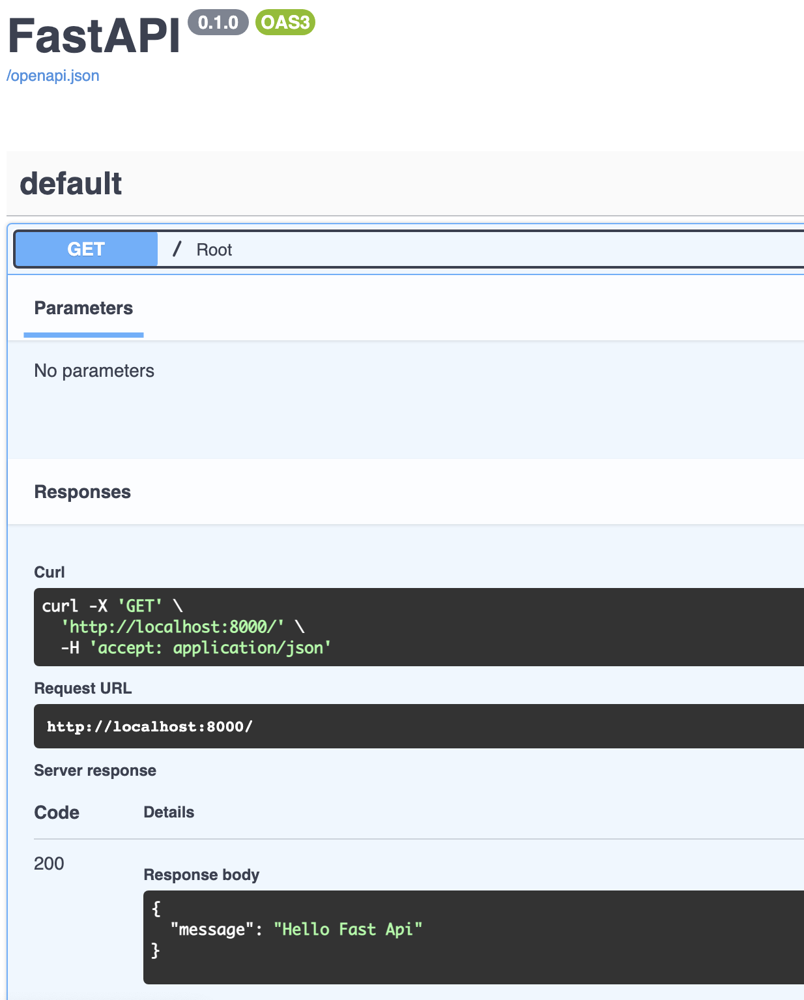

# Fast Api

python version : 3.6+
#### 1. Fast Api 패키지 설치
- bash   
  `$pip install fastapi[all]`

### 2. Python Project & main.py 생성
- main.py
    ```python
    from fastapi import FastAPI # 1
    
    app = FastAPI() # 2
    
    @app.get("/") # 3
    async def root(): # 4
        return {"message" : "Hello Fast Api"} # 5
    ```
1. FastApi 임포트
2. Instance 생성
3. 루트 핸들러 생성
    - `@app.post()`
    - `@app.put()`
    - `@app.delete()`
    - `@app.options()`
    - `@app.head()`
    - `@app.patch()`
    - `@app.trace()`
4. 핸들러가 실행할 함수
5. 컨텐츠 반환
    - `dict`, `list` `str`, `int`등 json으로 자동 변환되는 객체들과 모델들이 있습니다.
    
    
### 3. Start Server
- bash   
`$uvicorn main:app --reload`
  1. `--reload` : 코드 변경시 자동 재시작  (개발에서만 사용)


### 4. 만든 API 호출해보기


### 5. API Docs 확인
Fast API는 API 문서를 자동으로 만들어 줍니다.
`http://localhost:8000/docs` 로 접속해서 확인해봅니다.

여기에서 API 목록과 결과 예시를 볼 수 있습니다.
`http://localhost:8000/redoc` 다른 버전의 문서경로입니다.

---
#### Reference
[Fast Api Tutorial](https://fastapi.tiangolo.com/ko/tutorial/)