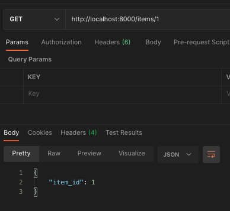
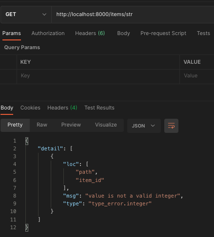
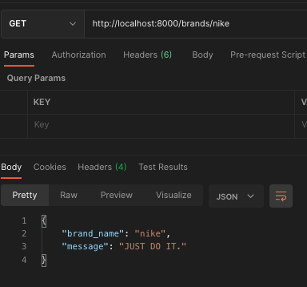
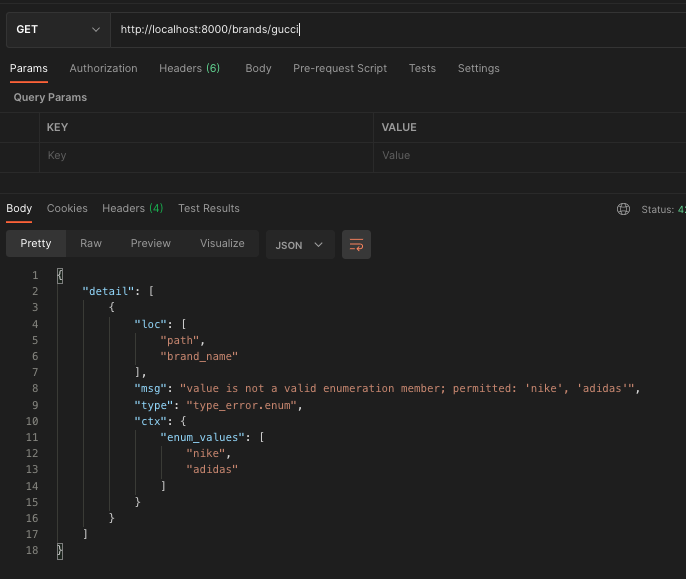

# Path Variable
## 기본 사용법
- main.py
```python
from fastapi import FastAPI
app = FastAPI()


@app.get("/items/{item_id}")
async def read_item(item_id):
    return {"item_id": item_id}
```

서버를 실행 한 후
PostMan으로 위에서 만든 핸들러를 호출해봅니다.



`{item_id}`로 받은 값이 출력되는 것을 확인할 수 있습니다.

## 매개변수 타입지정
Path Variable로 받는 매개변수의 타입을 지정하고 싶다면
```python
@app.get("/items/{item_id}")
async def read_item(item_id: int):
    return {"item_id": item_id}
```
`: int`로 지정해주면 됩니다.

> 만약 str 값을 넘길 경우 에러가 발생합니다. 
> 

## Enum 타입 매개변수
지정된 Enum 타입으로 매개변수를 받고 싶다면

- main.py
```python
from enum import Enum
from fastapi import FastAPI

app = FastAPI()

class Brand(str, Enum):
    nike = "nike"
    adidas = "adidas"

@app.get("/brands/{brand_name}")
async def get_brand(brand_name: Brand):
    if brand_name == Brand.nike:
        return {"brand_name": brand_name, "message": "JUST DO IT."}

    if brand_name == Brand.adidas:
        return {"brand_name": brand_name, "message": "IMPOSSIBLE IS NOTHING."}
```
- result
    
  - 등록되지 않은 Enum일 경우
    
    에러와 함께 등록된 Enum 목록을 알려줍니다.