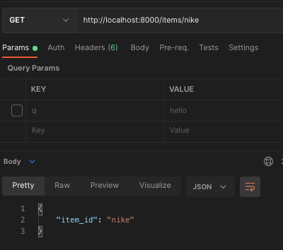
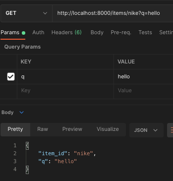
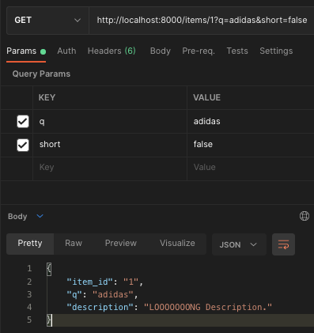
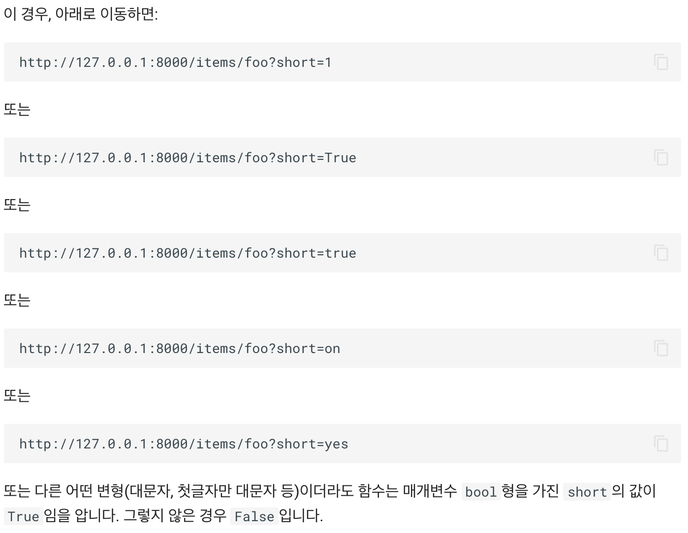

Query Parameters

Path Variable이 아닌 다른 함수 매개변수를 선언하면, 쿼리 매개변수로 자동 해석됩니다.

`Query Parameter`란 URL에서 `?` 후에 나오는 값을 말합니다.   
`&`로 구분되는 키-값 쌍의 집합   
> www.exmaple.com?size=10&page=1   
> `size : 10`/ `page : 1` 값입니다.
```python
# 임시 데이터
mock_items_db = [
    {"item_name": "Foo"},
    {"item_name": "Bar"},
    {"item_name": "Baz"}
]

@app.get("/items")
async def read_items(skip: int = 0, limit: int = 10):
    return mock_items_db[skip : skip + limit]
```
- `Path Variable`과 마찬가지로 타입 지정이 가능하며, 기본값을 지정할 수 있습니다.
```python
(skip: int = 0, limit: int = 10)
```
## Null 허용
`QueryParameter` 중 선택적으로 선언할 수 있습니다.
```python
from typing import Optional

@app.get("/items/{item_id}")
async def get_item(item_id : str, q: Optional[str] = None):
    if q:
        return {"item_id": item_id, "q": q}
    return {"item_id": item_id}
```
> Fast Api는 `q = None`이라는걸 선택적이라 인지합니다.   
> `Optional`은 Fast Api가 사용하는건 아니지만, 코드에서 오류를 찾아낼 수 있게 도와줍니다.
- `q`를 보내지 않은 경우


  
- `q`를 보낸 경우



## Boolean Type

```python
@app.get("/items/{item_id}")
async def get_item(item_id: str, q: Optional[str] = None, short: bool = False):
    item = {"item_id": item_id}
    if q:
        item.update({"q": q})
    if not short:
        item.update(
            {"description": "LOOOOOOONG Description."}
        )
    return item
```
- Result

  
>  예시로 아래 사진처럼 소개하는데 True 뜻을 가진 값은 True로 인식하는 것 같다.
> 

## 여러 경로 & 쿼리 매개변수

여러경로와 쿼리 매개변수를 동시에 선언해도 순서를 신경쓸 필요가 없습니다.
Fast Api는 변수의 이름으로 감지합니다.

```python
@app.get("/users/{user_id}/items/{item_id}")
async def read_user_item(
    user_id: int, item_id: str, q: Optional[str] = None, short: bool = False
):
    item = {"item_id": item_id, "owner_id": user_id}
    if q:
        item.update({"q": q})
    if not short:
        item.update(
            {"description": "This is an amazing item"}
        )
    return item
```

### 정리
`Query Parameter` 조건   
| conditions    | howto               |
|---------------|---------------------|
| require       | item_id: str        |
| nullable      | item_id: str = None |
| default value | size: int = 10      |
